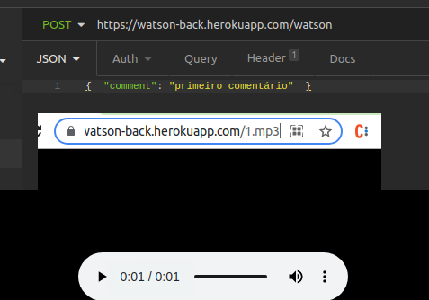

### No ultimo dia , estive trabalhando nessa ideia...
### A aplicação funciona bacana...Mas...

### E se funcionasse na nuvem?
### Aí seria outra coisa, não é mesmo?

### O primeiro passo foi criar umaa API serverless, a partir do template padrão, para armazenar em meu dynamoDB, 
### na AWS, os comentarios. Feito isso, passei a desenvolver um outro  backend em node.
### Esse também é capaz de armazenar os audios, só que na nuvem, e se conecta com a API  que traz as informações do banco de dados da AWS.

### Você ṕode verificar o funcionamento desse backend pelos links
### https://watson-back.herokuapp.com/comments , que te conectará ao banco de dados dynamoDB,
### bem como enviando requisições do tipo POST para https://watson-back.herokuapp.com/watson, com o comment no body. que armazenará temporariamente os comentários que ficarão disponível em https://watson-back.herokuapp.com/comments/1.mp3, https://watson-back.herokuapp.com/comments/2.mp3, e assim por diante.

### Precisei realizar alguns ajustes no front, o qual foi feito deploy no Amplify da Amazon.
### Mas houveram alguns problemas com as requisições, estou trabalhando nisso.
### Como o tempo está se esgotando, resolvi já postar assim mesmo, Pelo menos para mostrar um pouco mais de meu trabalho.
### Obrigado pela oportunidade.

### NOTA : ESSA API É PUBLICA. QUALQUER PALAVRA OFENSIVA OU INDEVIDA NÃO TERÁ SIDO DE MANEIRA ALGUMA ALÍ COLOCADA POR MIM, E NEM TÃO POUCO CORRESPONDERÁ AOS MEUS VALORES.
